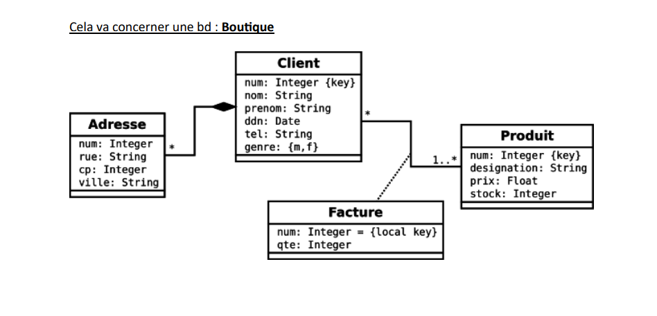

# TP Oracle & MySQL - Guide d'Utilisation

## Diagramme ERD (Entity-Relationship Diagram)

Le schema de la base de donnees "Boutique" est compose de 4 entites principales:



**Relations:**
- CLIENT (1) ---- (*) ADRESSE: Composition (un client a plusieurs adresses)
- CLIENT (*) ---- (1..*) PRODUIT: Association avec FACTURE comme classe d'association

---

## Configuration utilisee

### MySQL
- **Hote**: localhost
- **Port**: 3306
- **Utilisateur**: root
- **Mot de passe**: (aucun - vide)
- **Nombre d'enregistrements**: 25

### Oracle
- **Utilisateur**: sys as sysdba
- **Mot de passe**: momenic61

---

## Structure des fichiers

```
/workspace/
├── TP_Oracle_MySQL_Solutions.md    # Document complet avec toutes les commandes
├── README.md                        # Ce fichier
├── EXECUTION_RAPIDE.sh             # Script d'information complet
├── comparaison_performances.png    # Graphique de comparaison
├── scripts_mysql/
│   ├── 01_creation_base.sql
│   ├── 02_creation_tables.sql
│   ├── 03_procedures_insertion.sql
│   ├── 04_execution_insertions.sql
│   ├── 05_comparaison_performances.sql
│   ├── 06_analyse_et_plan.sql
│   └── 07_script_rapide.sh
└── scripts_oracle/
    ├── 01_creation_schema.sql      # Creation du schema approvisionnement
    ├── 02_creation_tables.sql      # Tables + donnees (CLIENT, ADRESSE, PRODUIT, FACTURE)
    └── 03_manipulation_donnees.sql # Vues, procedures, triggers
```

---

## PARTIE 1: ORACLE (Schema Boutique)

### Methode 1: Ligne de commande SQL*Plus

```bash
# 1. Lancer SQL*Plus avec connexion sysdba
sqlplus sys/momenic61 as sysdba

# 2. Executer le script de creation du schema
@/workspace/scripts_oracle/01_creation_schema.sql

# 3. Se deconnecter et se reconnecter avec le nouveau schema
CONNECT approvisionnement/approvisionnementeam
Mot de passe: approvisionnementeam

# 4. Creer les tables et inserer les donnees
@/workspace/scripts_oracle/02_creation_tables.sql

# 5. Executer les manipulations avancees (vues, procedures, triggers)
@/workspace/scripts_oracle/03_manipulation_donnees.sql
```

### Methode 2: Connexion avec TNS

```bash
# Si vous avez un fichier tnsnames.ora configure
sqlplus sys/momenic61@//localhost:1521/xe as sysdba
```

### Donnees inserees dans Oracle

**CLIENT (5 enregistrements):**
| num | nom | prenom | ddn | tel | genre |
|-----|-----|--------|-----|-----|-------|
| 1 | Dupont | Jean | 1985-03-15 | 0612345678 | m |
| 2 | Martin | Marie | 1990-07-22 | 0687654321 | f |
| 3 | Durand | Pierre | 1978-11-08 | 0611223344 | m |
| 4 | Bernard | Sophie | 1995-02-14 | 0655443322 | f |
| 5 | Petit | Thomas | 1982-09-30 | 0633445566 | m |

**ADRESSE (6 enregistrements):**
| num (FK) | rue | cp | ville |
|----------|-----|-----|-------|
| 1 | Rue de la Paix | 75001 | Paris |
| 1 | Avenue des Champs | 69002 | Lyon |
| 2 | Boulevard Saint-Michel | 13001 | Marseille |
| 3 | Place de la Republique | 31000 | Toulouse |
| 4 | Rue Saint-Catherine | 33000 | Bordeaux |
| 5 | Avenue de la Mer | 06000 | Nice |

**PRODUIT (10 enregistrements):**
| num | designation | prix | stock |
|-----|-------------|------|-------|
| 1 | Ordinateur portable | 899.99 | 25 |
| 2 | Smartphone | 599.99 | 50 |
| 3 | Tablette | 349.99 | 30 |
| 4 | Casque audio | 149.99 | 100 |
| 5 | Clavier sans fil | 79.99 | 75 |
| 6 | Souris sans fil | 49.99 | 80 |
| 7 | Ecran 27 pouces | 399.99 | 15 |
| 8 | Imprimante | 199.99 | 20 |
| 9 | Disque SSD 1To | 109.99 | 60 |
| 10 | Cle USB 64Go | 19.99 | 200 |

**FACTURE (10 enregistrements):**
| num | num_client | num_produit | qte |
|-----|------------|-------------|-----|
| 1 | 1 | 1 | 1 |
| 1 | 1 | 4 | 2 |
| 2 | 2 | 2 | 1 |
| 3 | 3 | 7 | 1 |
| 4 | 4 | 3 | 2 |
| 5 | 5 | 5 | 1 |
| 5 | 5 | 6 | 2 |
| 6 | 1 | 9 | 3 |
| 7 | 2 | 10 | 5 |
| 8 | 3 | 8 | 1 |

---

## PARTIE 2: MYSQL (Comparaison Index)

### Methode 1: Execution automatique (Recommande)

```bash
# Rendre le script executable
chmod +x /workspace/scripts_mysql/07_script_rapide.sh

# Executer le script automatique
./workspace/scripts_mysql/07_script_rapide.sh
```

### Methode 2: Execution manuelle ligne de commande

```bash
# Connexion MySQL
mysql -h localhost -P 3306 -u root

# Puis executer les scripts dans l'ordre:
source /workspace/scripts_mysql/01_creation_base.sql
source /workspace/scripts_mysql/02_creation_tables.sql
source /workspace/scripts_mysql/03_procedures_insertion.sql
source /workspace/scripts_mysql/04_execution_insertions.sql
source /workspace/scripts_mysql/05_comparaison_performances.sql
source /workspace/scripts_mysql/06_analyse_et_plan.sql
```

---

## Resultats attendus

### Oracle - Boutique Schema
- Schema `approvisionnement` cree
- 5 clients avec adresses
- 10 produits avec prix et stock
- 10 lignes de facture
- Vues: VUE_RESUME_STOCK
- Procedures: AUGMENTER_STOCK, NOUVELLE_FACTURE
- Trigger: TRG_ALERTE_STOCK

### MySQL - Comparaison Index
- Base de donnees `tp_comparaison_index` creee
- 6 tables creees (3 avec index, 3 sans)
- 75 enregistrements inseres (25 clients, 25 produits, 25 commandes)
- 8 tests de performance executes
- Tableau comparatif genere

---

## Tests de performance MySQL

1. SELECT simple avec WHERE
2. Recherche par ville
3. Jointure clients-commandes
4. Aggregation par categorie
5. Requete complexe avec sous-requete
6. Tri sur plusieurs colonnes
7. Mise a jour massive
8. Suppression avec condition

---

## Commandes utiles

### MySQL
```bash
# Connexion
mysql -h localhost -P 3306 -u root

# Voir les bases
SHOW DATABASES;

# Utiliser une base
USE tp_comparaison_index;

# Voir les tables
SHOW TABLES;

# Voir la structure
DESCRIBE nom_table;

# Voir les index
SHOW INDEX FROM nom_table;

# Plan d'execution
EXPLAIN SELECT ...;

# Profiling
SET profiling = 1;
SHOW PROFILES;

# Quitter
EXIT;
```

### Oracle SQL*Plus
```bash
# Lancer
sqlplus sys/momenic61 as sysdba

# Connexion standard
CONNECT approvisionnement/approvisionnementeam

# Executer un script
@/workspace/scripts_oracle/02_creation_tables.sql

# Voir les tables
SELECT table_name FROM user_tables;

# Voir les donnees d'une table
SELECT * FROM client;

# Quitter
EXIT;
```

---

## Depannage

### MySQL
```bash
# Verifier si le service est demarre (Linux)
sudo systemctl status mysql

# Demarrer le service (Linux)
sudo systemctl start mysql

# Verifier le port
netstat -tlnp | grep 3306

# Erreur de connexion
mysql -h localhost -P 3306 -u root -e "SELECT 1"
```

### Oracle
```bash
# Connexion sans listener (Oracle Express)
sqlplus sys/momenic61 as sysdba

# ORA-01034: ORACLE not available
sqlplus / as sysdba
STARTUP

# ORA-01017: invalid username/password
# Verifier les identifiants: sys/momenic61 as sysdba
```

---

## Pour le rapport TP

Structure suggeree:

1. **Introduction**: Objectif du TP, presentation du schema Boutique
2. **Partie Oracle**: 
   - Creation du schema approvisionnement
   - Tables CLIENT, ADRESSE, PRODUIT, FACTURE
   - Relations et contraintes
   - Vues, procedures et triggers
3. **Partie MySQL**: 
   - Comparaison des performances avec/sans index
   - 25 enregistrements par table
   - Resultats des tests
4. **Resultats**: Tableaux comparatifs
5. **Analyse**: Interpretation des gains/pertes
6. **Conclusion**: Importance des index

---

**Bon courage pour votre TP !**
